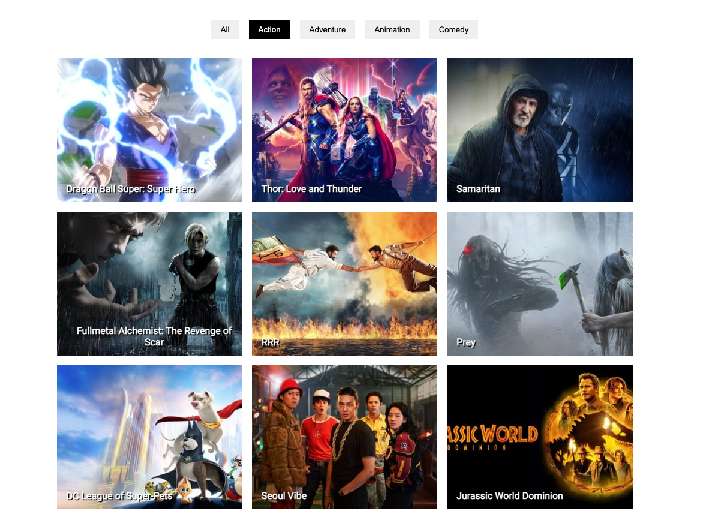

This project was bootstrapped with [vite](https://vitejs.dev/guide/#scaffolding-your-first-vite-project).

## Available Scripts

In the project directory, you can run:

### `yarn`

Instal All dependencies in this project

### `yarn dev`

Runs the app in the development mode. 
Open [http://127.0.0.1:5173](http://127.0.0.1:5173) to view it in the browser.

### Link

get api key = https://www.themoviedb.org/settings/api\
get popular url = https://developers.themoviedb.org/3/movies/get-popular-movies\
framer motion = https://www.framer.com/docs/introduction\

- adding-custom-environment-variables
put env in vite = https://vitejs.dev/guide/env-and-mode.html\
put ent in cra = https://create-react-app.dev/docs\

### Video Tutorial

You can see my youtube video for this project in [here]()